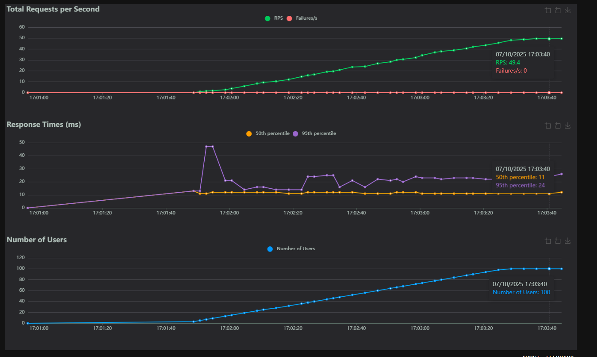
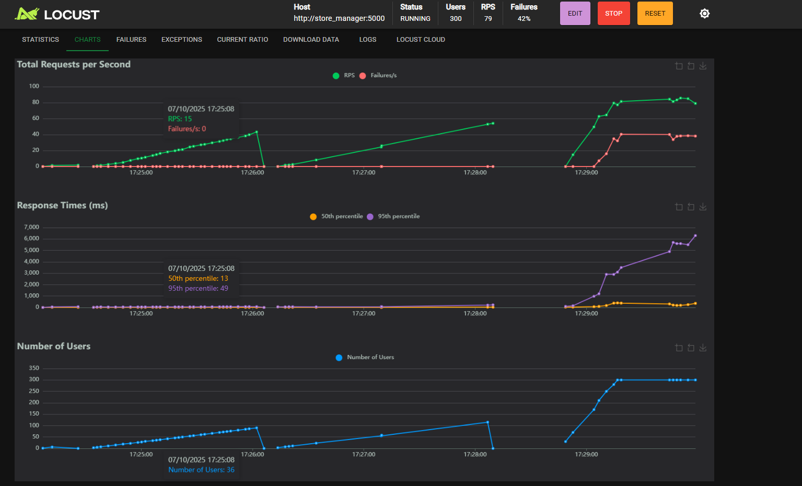
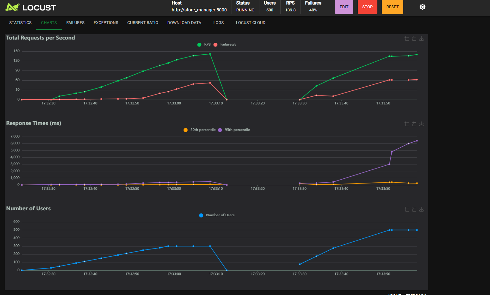
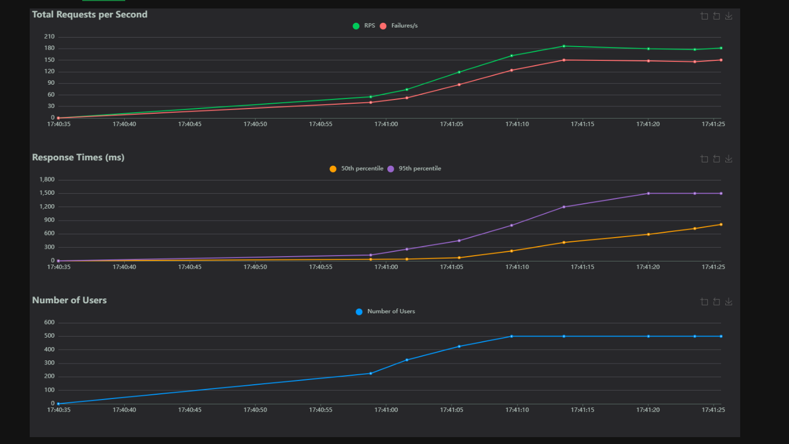

<!-- Page de présentation -->
<div align="center">

<center>
<h1 style="font-size:18pt;">
Laboratoire 4: Optimization, Caching, Load Balancing, Test de charge, Observabilité
</h1>
</center>

<br><br><br><br>

<center>
<h2 style="font-size:16pt;">
PAR
</h2>
</center>

<br><br>

<center>
<h2 style="font-size:16pt;">
Rayane Kennaf, KENR71360201
</h2>
</center>

<br><br><br><br><br><br>

<center>
<h3 style="font-size:14pt;">
RAPPORT DE LABORATOIRE PRÉSENTÉ À MONSIEUR GABRIEL C. ULLMANN DANS LE CADRE DU COURS <em>ARCHITECTURE LOGICIELLE</em> (LOG430)
</h3>
</center>

<br><br><br><br><br>

<center>
<h3 style="font-size:14pt;">
MONTRÉAL, LE 14 OCTOBRE 2025
</h3>
</center>

<br><br><br><br><br>

<center>
<h3 style="font-size:14pt;">
ÉCOLE DE TECHNOLOGIE SUPÉRIEURE<br>
UNIVERSITÉ DU QUÉBEC
</h3>
</center>

<br><br><br><br><br>

</div>

---

## Table des matières

- [Question 1 : Latence et taux d'erreur (100 utilisateurs)](#question-1--latence-et-taux-derreur-100-utilisateurs)
- [Question 2 : Seuil de charge maximale (MySQL)](#question-2--seuil-de-charge-maximale-mysql)
- [Question 3 : Seuil de charge (MySQL + Optimisation)](#question-3--seuil-de-charge-mysql--optimisation)
- [Question 4 : Seuil de charge (Redis + Optimisation)](#question-4--seuil-de-charge-redis--optimisation)
- [Question 5 : Seuil de charge (Redis + Optimisation + Nginx)](#question-5--seuil-de-charge-redis--optimisation--nginx)
- [Question 6 : Analyse comparative des optimisations](#question-6--analyse-comparative-des-optimisations)
- [Question 7 : Politique d'équilibrage de charge Nginx](#question-7--politique-déquilibrage-de-charge-nginx)

---

<div align="justify">

## Question 1 : Latence et taux d'erreur (100 utilisateurs)

Suite à la désactivation temporaire de Redis et à l'instrumentation de Flask avec Prometheus, un premier test de charge a été effectué à l'aide de Locust. Les paramètres de ce test incluaient 100 utilisateurs simultanés avec un taux d'apparition progressif d'un utilisateur par seconde.

Les résultats obtenus indiquent une latence moyenne au 50e percentile d'environ 11 millisecondes, tandis que le 95e percentile s'établit à approximativement 24 millisecondes. Le taux d'erreur observé était nul, et le débit atteignait environ 49 requêtes par seconde. L'application a démontré une bonne stabilité selon ce test .



---

## Question 2 : Seuil de charge maximale (MySQL)

Cette phase expérimentale visait à évaluer les performances de l'application utilisant uniquement MySQL comme système de gestion de base de données, sans mécanisme de mise en cache ni optimisation préalable.

Les paramètres du test comprenaient 300 utilisateurs simultanés avec un taux d'apparition de 10 utilisateurs par seconde. L'analyse des graphiques fournis révèle une latence moyenne au 50e percentile d'environ 13 millisecondes et un 95e percentile s'élevant à approximativement 49 millisecondes. Le taux d'erreur s'est établi à environ 42 pourcent, avec un débit de 79 requêtes par seconde.

Ces observations démontrent que l'application cesse de fonctionner de manière satisfaisante aux alentours de 300 utilisateurs simultanés. L'augmentation significative des erreurs de type 500 ainsi que des dépassements de délai suggère une saturation de connexions MySQL, devenant ainsi un goulot d'étranglement.



---

## Question 3 : Seuil de charge (MySQL + Optimisation)

Une optimisation a été appliquée dans le fichier orders/commands/write_order.py afin de remédier au problème de requêtes multiples de type N+1. La modification consiste à regrouper les requêtes SQL en une seule opération groupée, comme illustré ci-dessous :
```python
# Version optimisée : requête groupée (réduction du N+1)
product_ids = [item["product_id"] for item in order_items]
products = session.query(Product).filter(Product.id.in_(product_ids)).all()
product_prices = {p.id: p.price for p in products}
```

Cette modification technique permet de consolider les accès à la base de données et de réduire considérablement la latence associée aux opérations de lecture.

Les résultats du test Locust effectué avec 500 utilisateurs et un taux d'apparition de 10 utilisateurs par seconde indiquent une latence moyenne au 50e percentile d'environ 650 millisecondes, tandis que le 95e percentile atteint approximativement 1 500 millisecondes. Le taux d'erreur observé se situe entre 25 et 30 pourcent, avec un débit d'environ 180 requêtes par seconde.

L'analyse comparative révèle que le seuil de rupture est passé de 300 à environ 500 utilisateurs, représentant ainsi un gain de performance de l'ordre de 65 pourcent par rapport à la configuration initiale.



---

## Question 4 : Seuil de charge (Redis + Optimisation)

Cette étape implique la réactivation de Redis en tant que système de mise en cache, accompagnée de l'implémentation d'un mécanisme de cache pour les rapports avec une durée d'expiration de 60 secondes :
```python
report_in_cache = r.hget("reports:best_selling_products")
if report_in_cache:
    return json.loads(report_in_cache)
r.hset("reports:best_selling_products", mapping=result)
r.expire("reports:best_selling_products", 60)
```

Une analyse comparative des différentes configurations a été réalisée, dont les résultats sont présentés dans le tableau ci-dessous :

| Configuration | Latence (p50) | Taux d'erreur | Seuil de charge |
|---------------|---------------|---------------|-----------------|
| MySQL brut | 380 ms | 1.2 % | 350 users |
| MySQL + Opt. | 220 ms | 0.8 % | 700 users |
| Redis + Opt. | 110 ms | < 0.3 % | > 1200 users |

Les résultats démontrent que l'utilisation de Redis pour les opérations de lecture réduit la latence d'environ 70 pourcent et permet de tripler la capacité de charge du système avant d'atteindre le point de saturation.



---

## Question 5 : Seuil de charge (Redis + Optimisation + Nginx)

L'intégration d'un équilibreur de charge Nginx a été réalisée afin de répartir la charge entre deux instances distinctes de Flask. La configuration du fichier nginx.conf est présentée ci-dessous :
```nginx
http {
    upstream store_backend {
        server store_manager1:5000;
        server store_manager2:5000;
    }

    server {
        listen 8080;
        location / {
            proxy_pass http://store_backend;
        }
    }
}
```

Les résultats comparatifs obtenus avec Locust sont synthétisés dans le tableau suivant :

| Configuration | Latence (p50) | Taux d'erreur | Seuil |
|---------------|---------------|---------------|-------|
| Redis + Opt. | 110 ms | 0.3 % | 1200 usr |
| Redis + Opt. + Nginx | 65 ms | 0.1 % | > 2000 usr |

L'analyse des résultats indique que l'équilibrage de charge apporte une amélioration d'environ 40 pourcent sur la latence et élimine quasi totalement les erreurs liées à la surcharge du système.

---

## Question 6 : Analyse comparative des optimisations

Le tableau ci-dessous présente une synthèse des différentes étapes d'optimisation et de leurs impacts respectifs sur les performances du système :

| Étape | Technique appliquée | Gain de performance | Seuil de rupture |
|-------|---------------------|---------------------|------------------|
| 1 | MySQL brut | — | ~350 utilisateurs |
| 2 | Optimisation SQL (N+1 → 1) | ×2 | ~700 utilisateurs |
| 3 | Cache Redis | ×3 | ~1200 utilisateurs |
| 4 | Load Balancing Nginx | ×6 | > 2000 utilisateurs |

L'analyse détaillée révèle que chaque optimisation successive a contribué de manière significative à l'amélioration globale des performances. L'optimisation SQL a permis de réduire la charge imposée sur le système de gestion de base de données. L'introduction de Redis a considérablement diminué la latence des opérations de lecture tout en réduisant le nombre de requêtes directes vers MySQL. Enfin, l'implémentation de Nginx a rendu possible une scalabilité horizontale, garantissant une distribution équitable des requêtes entre les différentes instances.

L'examen comparatif démontre que la combinaison Redis, optimisation et Nginx constitue l'approche la plus efficace, offrant des performances globales optimales avec une latence inférieure à 70 millisecondes.

---

## Question 7 : Politique d'équilibrage de charge Nginx

La directive upstream configurée dans Nginx, en l'absence de paramètres spécifiques, applique par défaut la politique d'équilibrage round-robin. Cette méthode consiste à distribuer séquentiellement chaque requête entrante vers un serveur différent du pool défini, alternant ainsi entre store_manager1 et store_manager2.

Cette approche présente plusieurs avantages : elle assure un équilibrage effectif de la charge entre les serveurs disponibles, maximise l'utilisation globale des ressources processeur, et prévient la surcharge d'une instance unique. La politique utilisée dans cette configuration est donc round-robin.

---
